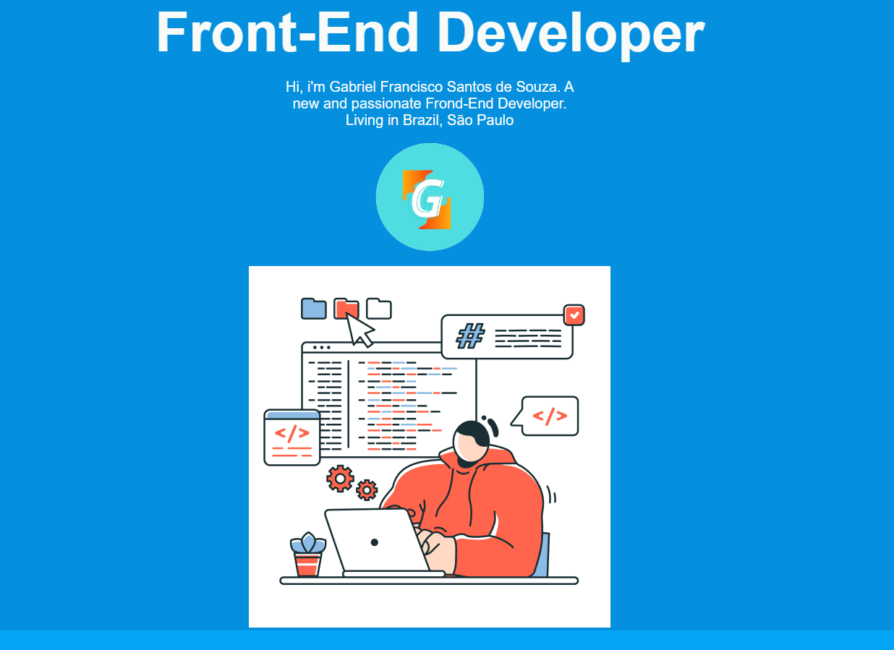

<h3>Hi! there</h3>
 <h1>My portfolio</h1>

Welcome to my portfolio. Here I put some of my projects and tell a little about my career.

My portfolio is separeted in 4 parts Home, About, Projects, Contact.

I put up a hamburger menu to make it easy to navigate through the site.

 
Coloque esses comandos no package.json se for colocar o projeto no github:     // "predeploy": "npm run build",
    // "deploy": "gh-pages -d dist"

    Como eu fiz a animação que acontece quando o mouse passa sobre a image
    1.as duas partes que devem se conectar dever ficar por padrão fora da imagem
    Elas devem ficar fora, pois assim o evento funcionará como ele deve funcionar(mouseover evento é executado, tira o mouse e a classe é removida, mas se os elementos por padrão ficarem sobre a imagem o evento não pode ser executado, por esse motivo é importante adicionar margin a imagem assim quando as duas divs estiverem por completo sobre a imagem haverá espaço para executar o evento )
    2.Por não ter um conhecimento mais aprofundado sobre seletores do CSS eu pensei que seria necessário usar JS e estados do React, mas é possivel fazer o efeito usando apenas usando CSS.
    Para fazer a animação inicial de encontro entre as duas partes primeiro coloque as duas partes para fora da imagem usando transformY, em seguida eu fiz as animação que juntão as duas partes sobre a imagem usando @keyframe, depois eu use o seletor que só executa o código dentro de sí assim que passamos o mouse sobre o elemento pai(a imagem nesse caso):
    section:hover .uperPart {
        animation: 1s ParaBaixo;
        animation-fill-mode: forwards;
    }
    o seletor é uma combinação onde o elemento pai que ativa o evento hover e o elemento filho que terá o código aplicado sobre sí
    Para fazer com que os elementos não voltem para suas posições anteriores assim que a animação terminar eu também coloquei a propriedade animation-fill-mode com o valor forward, isso faz com que o elemento permaneça onde a animação terminou.
    Para criar um efeito de retorno assim que o mouse sair da imagem uma outra animação de retorno que possui os valores inversos a anterior foi criada e um seletor que pega o momento em que tiramos o mouse da imagem da bem foi adicionado, possuindo a animação como código a ser executado: 
    // Animação de retorno
    @keyframes ParaBaixoRetorno {
  from {
    transform: translateY(0%);
  }
  to {
    transform: translateY(-100%);
  }
}

// O seletor
section:not(:hover) .uperPart {
  animation: 1s ParaBaixoRetorno;
  animation-fill-mode: forwards;
}

OBS: Por algum motivo os botões do MUI não estão funcionando no Vercel, vou remove-los

Agora que comecei a trabalhar em um mercado o tempo que tenho para programar diminuiu muito, mas isso não vai me fazer desistir de entrar na area. 

De qualquer maneira espero que o projeto esteja em um bom estado e infelizmente a primeira conexão com o back-end leva um pouco de tempo para acontecer, mas peço que tenha um pouco de paciência e agradeço pela atenção em ver o meu projeto.